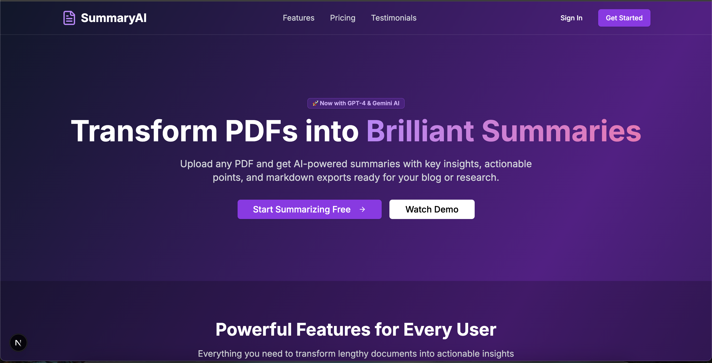
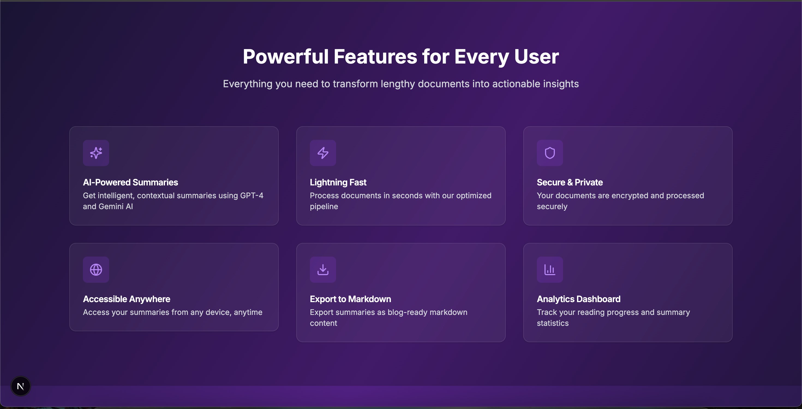
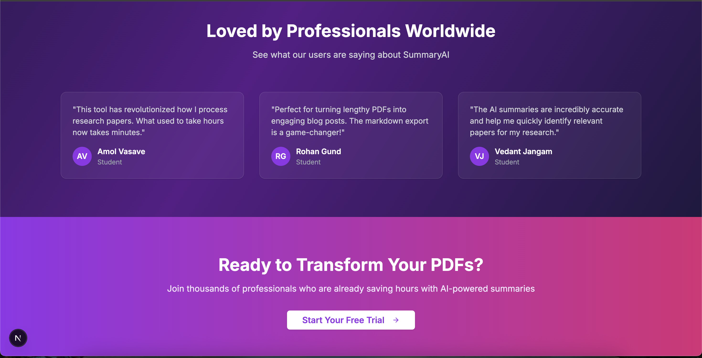
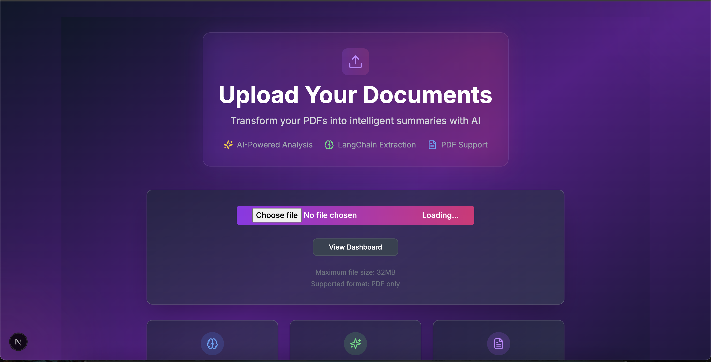
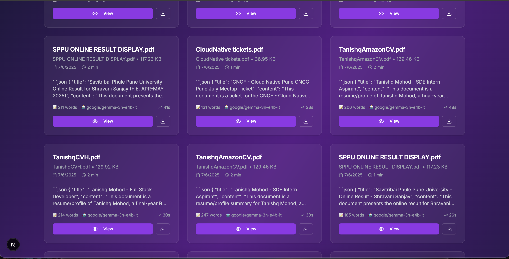
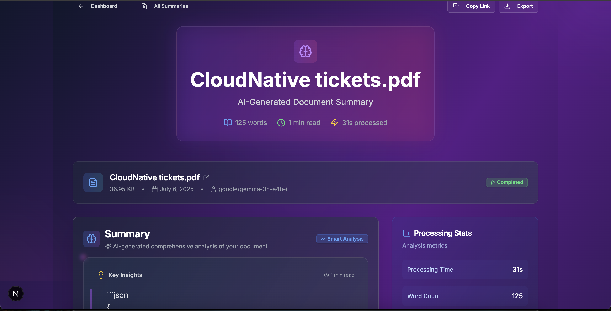

# 📄 PDF Summary SaaS

A modern, AI-powered PDF summarization platform that transforms lengthy documents into clear, structured summaries with key insights. Built with Next.js 15, React 19, and GPT-4 for intelligent document processing.


## ✨ Features

### 📝 Smart Summarization

- **Clear, structured summaries** with key points and insights
- **GPT-4 powered analysis** with contextual understanding
- **Emoji-enhanced output** for better readability
- **SEO-friendly summary generation** for content optimization
- **Markdown export** that can be converted into blog posts

### 🎨 Interactive Dashboard

- **Beautiful, interactive summary viewer** with progress tracking
- **Real-time updates** and path revalidation
- **User dashboard** for managing summaries
- **Responsive design** for mobile and desktop
- **Toast notifications** for upload status, processing updates, and error handling

### 🔒 Security & Performance

- **Secure file handling** and processing
- **Protected routes** and API endpoints
- **Performance optimizations** for fast loading
- **Server-side rendering** with Next.js 15 App Router

### 📊 Analytics & Management

- **User dashboard** with statistics and recent summaries
- **Document processing tracking**
- **Word count analytics**
- **Processing time monitoring**

## 📸 Screenshots

Here are screenshots of the PDF Summary SaaS application:

### 🏠 Home Page





### 📊 Dashboard


### 📤 Upload Page



### 📄 Summary Pages




## 🛠️ Tech Stack

### Frontend

- **🚀 Next.js 15** - App Router for server-side rendering, routing, and API endpoints with Server Components and Server Actions
- **⚛️ React 19** - Building interactive user interfaces with reusable components
- **🎨 ShadcN UI** - Accessible, customizable React components
- **💅 TailwindCSS 4** - Utility-first, responsive styling
- **📜 TypeScript** - Static typing and enhanced development experience

### Backend & AI

- **🤖 GPT-4** - Powered summarization with contextual understanding and emoji-enhanced output
- **🧠 Langchain** - PDF parsing, text extraction, and document chunking
- **📤 UploadThing** - Secure PDF uploads (up to 32MB) and file management

### Authentication & Database

- **🔑 Clerk** - Secure authentication with Passkeys, Github, and Google Sign-in
- **💾 NeonDB (PostgreSQL)** - Serverless database storage of summaries and user data

### Deployment

- **🚀 Vercel** - Production-ready deployment

## 📋 Prerequisites

Before you begin, ensure you have the following installed:

- [Node.js](https://nodejs.org/) (v18 or higher)
- [npm](https://www.npmjs.com/) or [yarn](https://yarnpkg.com/)
- [Git](https://git-scm.com/)

## 🚀 Getting Started

### 1. Clone the Repository

```bash
git clone https://github.com/Tanishq67m/PdfSummarySaaS.git
cd PdfSummarySaaS
```

### 2. Install Dependencies

```bash
npm install
# or
yarn install
```

### 3. Environment Setup

Create a `.env.local` file in the root directory and add the following environment variables:

```env
# Database
DATABASE_URL="your-neon-database-url"

# Authentication (Clerk)
NEXT_PUBLIC_CLERK_PUBLISHABLE_KEY="your-clerk-publishable-key"
CLERK_SECRET_KEY="your-clerk-secret-key"

# OpenAI
OPENAI_API_KEY="your-openai-api-key"

# UploadThing
UPLOADTHING_SECRET="your-uploadthing-secret"
UPLOADTHING_APP_ID="your-uploadthing-app-id"

# App Configuration
NEXT_PUBLIC_APP_URL="http://localhost:3000"
```

### 4. Database Setup

Run the database migrations:

```bash
# Install Drizzle CLI
npm install -g drizzle-kit

# Run migrations
npm run db:migrate

# Or use the provided script
npm run db:setup
```

### 5. Start the Development Server

```bash
npm run dev
# or
yarn dev
```

Open [http://localhost:3000](http://localhost:3000) in your browser to see the application.

## 📁 Project Structure

```
pdf-summary-saas/
├── src/
│   ├── app/                    # Next.js 15 App Router
│   │   ├── (auth)/            # Authentication routes
│   │   ├── (dashboard)/       # Protected dashboard routes
│   │   ├── api/               # API endpoints
│   │   └── globals.css        # Global styles
│   ├── components/            # Reusable React components
│   │   ├── ui/               # ShadcN UI components
│   │   └── navbar.tsx        # Navigation component
│   ├── lib/                  # Utility libraries
│   │   ├── ai/              # AI/OpenAI integration
│   │   ├── db/              # Database configuration
│   │   ├── pdf/             # PDF processing utilities
│   │   ├── services/        # Business logic services
│   │   └── uploadthing.ts   # File upload configuration
│   └── types/               # TypeScript type definitions
├── scripts/                 # Database scripts and utilities
├── public/                  # Static assets
└── package.json            # Dependencies and scripts
```

## 🔧 Configuration

### Database Configuration

The project uses NeonDB (PostgreSQL) with Drizzle ORM. Configure your database connection in `src/lib/db/index.ts`.

### Authentication Setup

1. Create a Clerk account at [clerk.com](https://clerk.com)
2. Set up your application and get your API keys
3. Configure authentication providers (Google, GitHub, etc.)

### OpenAI Configuration

1. Get your OpenAI API key from [platform.openai.com](https://platform.openai.com)
2. Add it to your environment variables
3. Configure the AI model in `src/lib/ai/summarizer.ts`

### UploadThing Setup

1. Create an account at [uploadthing.com](https://uploadthing.com)
2. Create a new project and get your API keys
3. Configure file upload settings in `src/lib/uploadthing.ts`

## 🚀 Deployment

### Deploy to Vercel

1. **Connect your repository:**

   - Go to [vercel.com](https://vercel.com)
   - Import your GitHub repository
   - Configure environment variables

2. **Set up environment variables in Vercel:**

   - Go to your project settings
   - Add all the environment variables from your `.env.local`

3. **Deploy:**
   - Vercel will automatically deploy on every push to main
   - Or manually trigger a deployment

### Environment Variables for Production

Make sure to set these in your Vercel dashboard:

```env
DATABASE_URL="your-production-database-url"
NEXT_PUBLIC_CLERK_PUBLISHABLE_KEY="your-clerk-publishable-key"
CLERK_SECRET_KEY="your-clerk-secret-key"
OPENAI_API_KEY="your-openai-api-key"
UPLOADTHING_SECRET="your-uploadthing-secret"
UPLOADTHING_APP_ID="your-uploadthing-app-id"
NEXT_PUBLIC_APP_URL="https://your-domain.vercel.app"
```

## 🔄 Available Scripts

```bash
# Development
npm run dev          # Start development server
npm run build        # Build for production
npm run start        # Start production server

# Database
npm run db:migrate   # Run database migrations
npm run db:setup     # Setup database with initial data
npm run db:reset     # Reset database

# Linting and Formatting
npm run lint         # Run ESLint
npm run lint:fix     # Fix ESLint errors
npm run format       # Format code with Prettier

# Type Checking
npm run type-check   # Run TypeScript type checking
```

## 🤝 Contributing

1. Fork the repository
2. Create a feature branch (`git checkout -b feature/amazing-feature`)
3. Commit your changes (`git commit -m 'Add some amazing feature'`)
4. Push to the branch (`git push origin feature/amazing-feature`)
5. Open a Pull Request

## 📝 License

This project is licensed under the MIT License - see the [LICENSE](LICENSE) file for details.

## 🆘 Support

If you encounter any issues or have questions:

1. Check the [Issues](https://github.com/Tanishq67m/PdfSummarySaaS/issues) page
2. Create a new issue with detailed information
3. Include screenshots and error messages when possible

## 🔮 Roadmap

- [ ] 💳 Stripe integration for subscription management
- [ ] 🔔 Email notifications for processing updates
- [ ] 📊 Advanced analytics dashboard
- [ ] 🎨 Custom themes and branding
- [ ] 📱 Mobile app development
- [ ] 🔍 Advanced search and filtering
- [ ] 📚 Document library management
- [ ] 🤝 Team collaboration features

## 🙏 Acknowledgments

- [Next.js](https://nextjs.org/) for the amazing framework
- [Clerk](https://clerk.com/) for authentication
- [OpenAI](https://openai.com/) for AI capabilities
- [ShadcN UI](https://ui.shadcn.com/) for beautiful components
- [Vercel](https://vercel.com/) for deployment

---

Made with ❤️ by [Tanishq Mohod](https://github.com/Tanishq67m)
